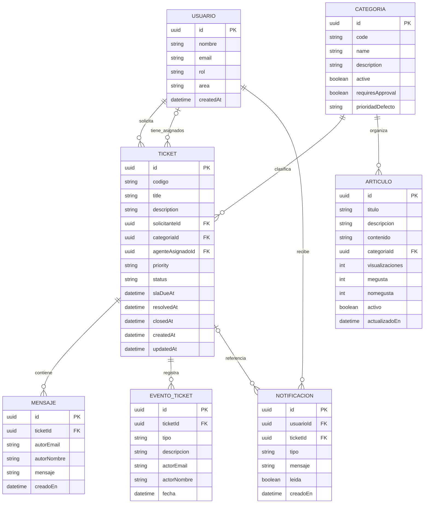

<h1 align="center"><strong>Arquitectura de Datos — ServiceFlow</strong></h1>

<strong>S08-26-equipo-7 - NoCountry 2026</strong>

Diagrama lógico de las entidades principales que se desprenden de la API y del modelo funcional. Los nombres de campos describen el modelo expuesto por la API; pueden diferir de los nombres físicos usados en la base de datos.

## Relaciones principales

- Un usuario puede solicitar muchos tickets y un ticket tiene un solicitante.
- Un agente puede tener asignados varios tickets; la asignación puede estar vacía.
- Cada ticket pertenece a una categoría.
- Un ticket puede tener varios mensajes y eventos de historial.
- Las notificaciones pertenecen a un usuario y pueden referenciar un ticket.
- Una categoría puede organizar varios artículos de conocimiento.

> [!NOTE]
> Este DER es una vista lógica resumida de la funcionalidad/API, no una extracción exacta del esquema físico de PostgreSQL. Los artículos de conocimiento son públicos y la API no expone una relación de autor; por eso no se inventa una relación artículo-usuario.
